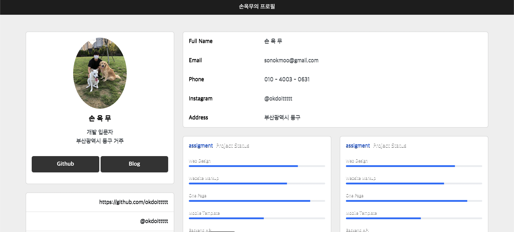
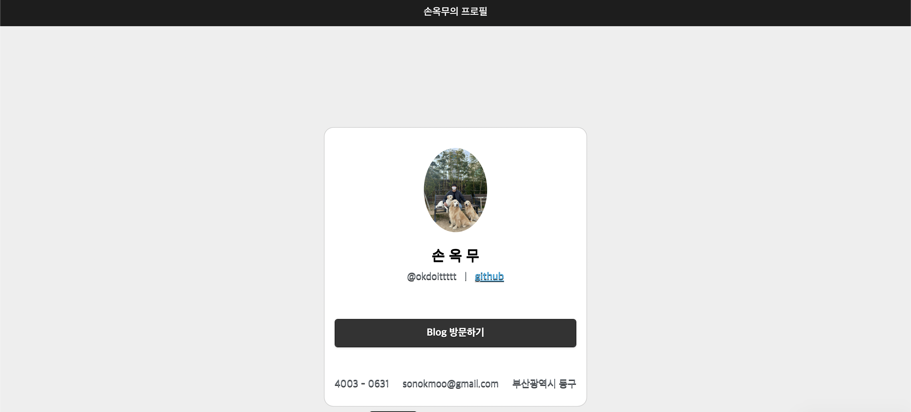
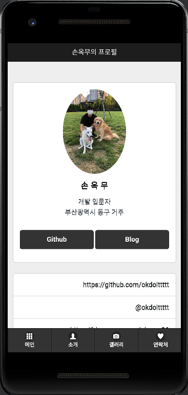

손옥무 프로필 하이브리드 앱 만들기
==========================

#### 페이지 구성
1. 메인 페이지
2. 프로필
3. 갤러리
4. 연락처

#### 페이지 구조
header -> title

body -> content

footer -> nav

#### 막대 그래프
[막대 그래프 출처 : 부트스트랩5](https://cdn.jsdelivr.net/npm/bootstrap@5.2.1/dist/js/bootstrap.bundle.min.js)

[부트스트랩 참고 URL](https://mdbootstrap.com)

[깃허브주소](https://okdoittttt.github.io/myprofie/)

# 하이브리드 앱 완료 화면

# Cordova를 활용한 모바일 하이브리드 앱 만드는 방법

### 하이브리드 앱 개요
모바일 환경에서 구동되는 애플리케이션을 제작하기 위해 3가지 기본 구성이 있다.
- 반응형 앱
- 하이브리드 앱
- 네이티브 앱

반응형 앱은 모바일 브라우저에서 URL입력을 통해 접속하는 방법으로 일반적인 웹사이트 제작 과정과 동일하며 반응형으로 제작한다. 브라우저에서 작동되며 따로 설치가 필요 없다.
우리가 하려하는 하이브리드 앱은 기존의 웹사이트 제작 방식과 동일하지만 애플리케이션의 형태로 제작하는 것을 말한다. 겉은 모바일 앱의 형태를 하고 있으며 애플리케이션 안에서 웹이 구동되는 방식이다.
네이티브 앱은 디바이스 운영체제에 맞는 네이티브 언어(안드로이드 - Kotlin | IOS - Swift)로 제작하는 것을 말한다.

기본적인 웹에 대한 기능만 작동하면 되는 경우라면 하이브리드 앱으로 제작하여 시간을 절약할 수 있다. 아래는 하이브리드 앱을 만드는 방법(사전 준비 단계)와 만다는 방법을 정리했다.

---------------------------------------

### 준비
1. JDK 1.8 ver.
2. Apache ant, Gradle 설치
3. Node.js ==> Cordova 설치용
4. Android Studio IDE

### 단계 1. JDK 설치하기
코르도바의 원활한 사용을 위해 JDK는 1.8 버전을 사용하도록 한다. 아래 링크를 클릭하여 오라클에 방문하고 다운로드 해주도록 하자.
Link: [Oracle][https://www.oracle.com/java/technologies/downloads/#java8-windows, oracle JDK Download]

### 단계 2. \hybridapp 디렉토리 생성하기
루트 디렉토리, 작업 폴더 하위에 hybridapp 폴더를 생성하도록 하자.
<pre>
<code>
mkdir hybridapp
</code>
</pre>

### 단계 3. 아파치 앤트, 그리들 설치하기
위 파일을 다운로드 받아 압축을 풀어주면 된다.

### 단계 4. 안드로이드 플랫폼 패키지 추가 설치하기
안드로이드 스튜디오를 실행한 후 Tools - SDK Manager 오픈 후 아래 설정을 해주도록 한다.

Android SDK Tools

Android SDK Platfor-tools

Android SDK Build-tools

Android R(Api 29, R preview)

SDK Platform

Android R Preview

Google Play Intel x86 Atom_64_System Image

Google APIs intel x86 Atom_64_System Image

Android Support Repository

Android Auto Desktop head unit emulator

Android auto API simulator

Google Repository

Google USB Driver

Google Play Services

Android SDK Command-line Tools

Intel x86 Emulator Accelerator(HAXM installer)

### 단계 5. 환경변수 설정하기
<pre>
<code>
$ /Library/Java/JavaVirtualMachines/{jdk.version}/Contents/Home
</code>
</pre>

### 단계 6. Node.js 설치, 코르도바 설치
<pre>
<code>
# HOMEBREW
export PATH="/opt/homebrew/bin:$PATH"
$ brew update
$ brew install nvm

export NVM_DIR="$HOME/.nvm"
[ -s "/opt/homebrew/opt/nvm/nvm.sh" ] && \. "/opt/homebrew/opt/nvm/nvm.sh"  # This loads nvm
[ -s "/opt/homebrew/opt/nvm/etc/bash_completion.d/nvm" ] && \. "/opt/homebrew/opt/nvm/etc/bash_completion.d/nvm"  # This loads nvm bash_completion

$ nvm -v

# 다운로드 받고자 하는 node.js 버전 입력
nvm install 17.2.0
$ npm install -g phonegap
$ npm install -g cordova
$ cordova -v
$ npm update -g phonegap
$ npm update -g cordova

# 코르도바 프로젝트 생성하기(작업폴더에서 실행)
cordova create test com.example.test testApp -d
cordova platform add android
</code>
</pre>

### 단계 7. 안드로이드 스튜디오에 설정 변경하기
build.gradle(:app)
<pre>
<code>
packagingOptions {

        exclude 'META-INF/DEPENDENCIES.txt'

        exclude 'META-INF/LICENSE.txt'

        exclude 'META-INF/NOTICE.txt'

        exclude 'META-INF/NOTICE'

        exclude 'META-INF/LICENSE'

        exclude 'META-INF/DEPENDENCIES'

        exclude 'META-INF/notice.txt'

        exclude 'META-INF/license.txt'

        exclude 'META-INF/dependencies.txt'

        exclude 'META-INF/LGPL2.1'

    }
</code>
</pre>

AndroidManifest.xml
<pre>
<code>
android:largeHeap="true"
</code>
</pre>

### 단계 8. 실행 확인
아래 명령어를 입력해 실행시키기
<pre>
<code>
cordova emulate android
</code>
</pre>
